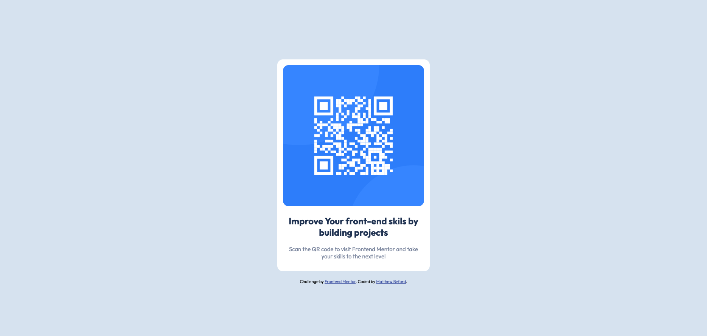

# Frontend Mentor - QR code component solution

This is a solution to the [QR code component challenge on Frontend Mentor](https://www.frontendmentor.io/challenges/qr-code-component-iux_sIO_H). Frontend Mentor challenges help you improve your coding skills by building realistic projects. 

## Table of contents

- [Overview](#overview)
  - [Screenshot](#screenshot)
  - [Links](#links)
- [My process](#my-process)
  - [Built with](#built-with)
  - [What I learned](#what-i-learned)
  - [Continued development](#continued-development)
- [Author](#author)

## Overview

### Screenshot

**Note: Delete this note and the paragraphs above when you add your screenshot. If you prefer not to add a screenshot, feel free to remove this entire section.**

### Links

- Solution URL: [Add solution URL here](https://your-solution-url.com)
- Live Site URL: [Add live site URL here](https://your-live-site-url.com)

## My process

### Built with

- SCSS / SASS
- Flex
- Semantic HTML Markup
- Google Fonts

**Note: These are just examples. Delete this note and replace the list above with your own choices**

### What I learned

I havent really learned anything new whilst doing this project, the practice and developing use of scss and smeantic markup is definetly a take away from this project though. 

### Continued development

I will continue to develop my skills in using flexbox and grid to create responsive designs. 

## Author

- Website - [Matthew Byford]
- Frontend Mentor - [@MrByford](https://www.frontendmentor.io/profile/MrByford)
